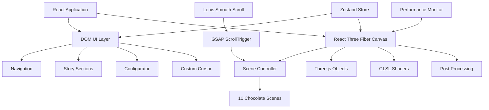
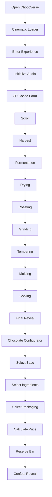

# 🍫 ChocoVerse — Interactive 3D Chocolate Experience

**ChocoVerse** is a cinematic, interactive 3D web experience that takes users through the complete journey of chocolate making — from the **cocoa farm to a finished luxury chocolate bar**.

Built with **React, TypeScript, Three.js, React Three Fiber, GSAP, Framer Motion, Lenis, and custom GLSL shaders**, the experience combines real-time 3D scenes, scroll-driven storytelling, spatial audio, cinematic post-processing, and an interactive chocolate configurator.

---

## ✨ Experience Overview

ChocoVerse transforms a traditional website into an interactive visual journey.

Instead of navigating through static pages, users **scroll through a continuous 3D environment** where the camera travels through each stage of the chocolate-making process.

```text
🌱 Cocoa Farm
      ↓
🌿 Harvest
      ↓
🧪 Fermentation
      ↓
☀️ Drying
      ↓
🔥 Roasting
      ↓
⚙️ Grinding
      ↓
🌡️ Tempering
      ↓
🧱 Molding
      ↓
❄️ Cooling
      ↓
🍫 Final Reveal
      ↓
✨ Custom Chocolate Bar
```

---

# 🌟 Key Features

* 🌎 **Cinematic 3D Environment**
* 🎬 **Scroll-Driven Storytelling**
* 🌱 **10 Interactive Chocolate-Making Stages**
* 🎥 **GSAP Camera Transitions**
* 🧊 **React Three Fiber WebGL Rendering**
* ✨ **Three.js Post-Processing**
* 💫 **Custom GLSL Shaders**
* 🖱️ **Cinematic Custom Cursor**
* 🎧 **Ambient Spatial Audio**
* 🎛️ **Interactive Chocolate Configurator**
* 🍫 **Dark / Milk / White Chocolate Selection**
* 🧂 **Premium Ingredient Selection**
* 📦 **Multiple Packaging Options**
* 💰 **Dynamic Product Pricing**
* 🎉 **Confetti Order Reveal**
* 📱 **Responsive UI**
* ⚡ **Adaptive Rendering Performance**
* 🌊 **Smooth Scrolling with Lenis**
* 🎨 **Framer Motion UI Animations**
* 🌓 **Luxury Cocoa / Gold Visual Theme**

---

# 🏗️ System Architecture

The application combines a React DOM interface with a real-time WebGL rendering layer.



---

# 🎬 Interactive Storytelling

The entire experience is controlled through a **10-stage scroll timeline**.

Each section corresponds to a dedicated 3D environment and DOM storytelling layer.

| Stage | Process         | Environment            |
| ----: | --------------- | ---------------------- |
|    01 | 🌱 Farm         | Cocoa Farm             |
|    02 | 🌿 Harvest      | Cocoa Harvest          |
|    03 | 🧪 Fermentation | Fermentation           |
|    04 | ☀️ Drying       | Sun Drying             |
|    05 | 🔥 Roasting     | Cocoa Roasting         |
|    06 | ⚙️ Grinding     | Grinding               |
|    07 | 🌡️ Tempering   | Chocolate Tempering    |
|    08 | 🧱 Molding      | Chocolate Molding      |
|    09 | ❄️ Cooling      | Controlled Cooling     |
|    10 | 🍫 Reveal       | Final Chocolate Reveal |

---

# 🌱 Stage 01 — Cocoa Origin

The experience begins inside a tropical cocoa farm.

Users are introduced to the origin of the chocolate journey before entering the production sequence.

```text
An Interactive Odyssey

CACAO ORIGIN

Follow the complete multi-sensory journey
from organic cocoa beans to premium tempered bars.
```

The user is prompted to **scroll to begin** the experience.

---

# 🌿 Stage 02 — Harvest

The journey continues from the cocoa farm into the harvesting process.

The camera transitions through the environment as the user scrolls, maintaining a continuous cinematic movement between scenes.

---

# 🧪 Stage 03 — Fermentation

The cocoa beans enter the fermentation stage.

The experience visualizes the transformation of cocoa beans through a controlled fermentation process.

```text
Flavor Awakening

Microbial Heat
48°C – 50°C

Duration
6 Days
```

Ambient sound design accompanies the visual experience.

---

# ☀️ Stage 04 — Sun Drying

The fermented cocoa beans are dried under controlled natural conditions.

```text
Sun & Spirit

Target Moisture
7% – 8%

Solar Exposure
7 Days
```

The scene communicates the transition from fermentation to dried cocoa beans.

---

# 🔥 Stage 05 — Roasting

The cocoa beans move into the roasting environment.

The 3D scene uses lighting, particles, materials, and camera movement to create a cinematic roasting experience.

---

# ⚙️ Stage 06 — Grinding

The roasted cocoa beans are transformed into a smooth chocolate mass.

The grinding environment focuses on mechanical movement and flowing chocolate visuals.

---

# 🌡️ Stage 07 — Tempering

The chocolate enters the tempering stage where controlled temperature changes create the desired crystal structure.

The scene uses liquid chocolate materials and visual effects to represent the transformation.

---

# 🧱 Stage 08 — Molding

The tempered chocolate is transferred into molds.

The camera moves through the molding environment while the DOM overlay explains the production stage.

---

# ❄️ Stage 09 — Controlled Cooling

The filled molds enter a controlled cooling environment.

```text
Controlled Cooling

Tunnel Temperature
10°C – 12°C

Setting Duration
15 Minutes
```

The scene combines cooling effects, environmental lighting, and industrial ambient sound design.

---

# 🍫 Stage 10 — Final Reveal

The journey concludes with the finished chocolate bar.

The final scene transitions from the production environment into the product reveal and opens the interactive customization experience.

---

# 🎛️ Chocolate Configurator

At the final reveal stage, users can design their own luxury chocolate bar.

The configurator supports three customization categories.

## 🍫 1. Base Cocoa Type

```text
Dark
Milk
White
```

Base prices:

```text
Dark   → $12.00
Milk   → $11.50
White  → $12.50
```

---

## 🧂 2. Infused Ingredients

Users can add premium ingredients:

| Ingredient               | Additional Price |
| ------------------------ | ---------------: |
| ✨ Luxury Gold Leaf Dust  |           +$5.00 |
| 🧂 Fleur de Sel Sea Salt |           +$1.50 |
| 🍓 Dried Raspberries     |           +$2.00 |
| 🌰 Roasted Hazelnuts     |           +$2.00 |

Multiple toppings can be selected simultaneously.

---

## 📦 3. Collection Packaging

```text
Classic
Premium
Collector
```

Packaging prices:

```text
Classic     → +$0.00
Premium     → +$4.50
Collector   → +$8.00
```

---

## 💰 Dynamic Pricing

The total price is calculated dynamically based on:

```text
Base Chocolate
      +
Selected Ingredients
      +
Packaging
      =
Total Valuation
```

Example:

```text
Dark Chocolate       $12.00
Gold Leaf             $5.00
Hazelnut              $2.00
Premium Packaging     $4.50
────────────────────────────
Total                 $23.50
```

---

# 🎉 Interactive Order Reveal

When the user selects:

```text
RESERVE BAR
```

the application triggers an animated **gold-themed confetti reveal**.

This creates a visual completion moment for the interactive chocolate experience.

---

# 🖥️ User Interface

The DOM interface includes:

* Cinematic loader
* Floating navigation bar
* Storytelling overlays
* Glassmorphism information cards
* Custom cursor
* Sound visualizer
* Scroll indicators
* Configurator modal
* Animated CTA buttons
* Responsive layouts

---

# 🧭 Navigation

The floating navigation provides quick access to major experience points.

```text
Cosmos
Factory
Origin
Gallery
Gift
```

Navigation automatically scrolls the user through the experience timeline.

The navigation also highlights the currently active story section.

---

# 🎧 Audio Experience

ChocoVerse includes an ambient audio system powered by the Web Audio API.

### Audio Features

* Ambient background sound
* Sound toggle
* Click sound effects
* Smooth volume transitions
* Audio initialization after user interaction

The audio system prevents unwanted autoplay behavior by initializing after the user enters the experience.

---

# 🖱️ Custom Cursor

After entering the experience, the default cursor is replaced with a cinematic custom cursor.

The cursor is implemented as a dedicated UI component:

```text
src/components/dom/ui/CustomCursor.tsx
```

The interface also hides the standard cursor for the cinematic experience.

---

# 🎥 Scroll-Driven Camera System

One of the core technical features is the scroll-controlled 3D camera.

The application uses:

```text
Lenis
   ↓
GSAP ScrollTrigger
   ↓
Scroll Progress
   ↓
Scene Controller
   ↓
Camera Position
   ↓
Camera LookAt
```

The camera smoothly interpolates between predefined positions as the user scrolls.

---

# 🎞️ GSAP Scene Transitions

`SceneController` divides the journey into **10 scroll phases**.

Each phase controls:

* Camera position
* Camera look-at target
* Active scene
* Scene visibility

The camera uses smooth interpolation to create continuous movement rather than abrupt scene changes.

---

# ⚡ Performance Optimization

Real-time WebGL rendering can be expensive, so ChocoVerse includes adaptive performance handling.

### Dynamic DPR Scaling

The application monitors performance and dynamically adjusts device pixel ratio.

```text
High FPS
  ↓
Increase DPR
  ↓
Higher Visual Quality
```

```text
Low FPS
  ↓
Decrease DPR
  ↓
Improved Performance
```

The default DPR is:

```text
1.5
```

with a supported range between:

```text
1.0 → 2.0
```

---

# 🧠 Smart Scene Rendering

Instead of rendering every environment simultaneously, the application renders:

```text
Current Scene
     +
Previous Scene
     +
Next Scene
```

This reduces unnecessary rendering while keeping transitions smooth and preventing visual pop-in.

---

# ✨ WebGL Post Processing

The project uses `@react-three/postprocessing`.

The rendering pipeline includes:

### Depth of Field

Creates cinematic focus and bokeh.

### Bloom

Adds glowing highlights to bright elements.

### Vignette

Creates cinematic edge darkening and draws attention toward the scene.

Post-processing is automatically disabled when the device pixel ratio reaches the low-performance threshold.

---

# 🧪 Custom GLSL Shaders

The project includes custom GLSL shader programs.

```text
src/shaders/
│
├── meltingChocolate/
│   ├── vertex.glsl
│   └── fragment.glsl
│
├── goldEnergy/
│   ├── vertex.glsl
│   └── fragment.glsl
│
└── liquidWaves/
    ├── vertex.glsl
    └── fragment.glsl
```

These shaders are used to create custom visual effects for:

* 🍫 Melting chocolate
* ✨ Gold energy
* 🌊 Liquid wave effects

---

# 🌌 3D Scene Architecture

The Three.js environments are separated into dedicated scene components.

```text
src/components/canvas/environments/

FarmScene.tsx
HarvestScene.tsx
FermentationScene.tsx
DryingScene.tsx
RoastingScene.tsx
GrindingScene.tsx
TemperingScene.tsx
MoldingScene.tsx
CoolingScene.tsx
RevealScene.tsx
```

Shared 3D elements are located under:

```text
src/components/canvas/shared/
```

Including:

```text
CocoaParticles.tsx
ChocolateBar.tsx
LiquidChocolate.tsx
GoldTrails.tsx
geometryHelpers.ts
```

---

# 📂 Directory Structure

```text
3D-Website-main/
│
├── public/
│   ├── icons.svg
│   └── favicon.svg
│
├── src/
│   │
│   ├── assets/
│   │   ├── hero.png
│   │   ├── react.svg
│   │   └── vite.svg
│   │
│   ├── components/
│   │   │
│   │   ├── canvas/
│   │   │   ├── environments/
│   │   │   │   ├── FarmScene.tsx
│   │   │   │   ├── HarvestScene.tsx
│   │   │   │   ├── FermentationScene.tsx
│   │   │   │   ├── DryingScene.tsx
│   │   │   │   ├── RoastingScene.tsx
│   │   │   │   ├── GrindingScene.tsx
│   │   │   │   ├── TemperingScene.tsx
│   │   │   │   ├── MoldingScene.tsx
│   │   │   │   ├── CoolingScene.tsx
│   │   │   │   └── RevealScene.tsx
│   │   │   │
│   │   │   ├── shared/
│   │   │   │   ├── CocoaParticles.tsx
│   │   │   │   ├── ChocolateBar.tsx
│   │   │   │   ├── LiquidChocolate.tsx
│   │   │   │   ├── GoldTrails.tsx
│   │   │   │   └── geometryHelpers.ts
│   │   │   │
│   │   │   ├── ChocoCanvas.tsx
│   │   │   ├── SceneController.tsx
│   │   │   └── PostProcessingPipeline.tsx
│   │   │
│   │   └── dom/
│   │       ├── Sections/
│   │       │   ├── FarmSection.tsx
│   │       │   ├── HarvestSection.tsx
│   │       │   ├── FermentationSection.tsx
│   │       │   ├── DryingSection.tsx
│   │       │   ├── RoastingSection.tsx
│   │       │   ├── GrindingSection.tsx
│   │       │   ├── TemperingSection.tsx
│   │       │   ├── MoldingSection.tsx
│   │       │   ├── CoolingSection.tsx
│   │       │   └── RevealSection.tsx
│   │       │
│   │       ├── ui/
│   │       │   └── CustomCursor.tsx
│   │       │
│   │       ├── ConfiguratorModal.tsx
│   │       ├── Loader.tsx
│   │       └── Navbar.tsx
│   │
│   ├── hooks/
│   │   ├── useAudio.ts
│   │   ├── usePerformanceMonitor.ts
│   │   └── useScrollProgress.ts
│   │
│   ├── shaders/
│   │   ├── meltingChocolate/
│   │   │   ├── vertex.glsl
│   │   │   └── fragment.glsl
│   │   ├── goldEnergy/
│   │   │   ├── vertex.glsl
│   │   │   └── fragment.glsl
│   │   └── liquidWaves/
│   │       ├── vertex.glsl
│   │       └── fragment.glsl
│   │
│   ├── store/
│   │   └── useStore.ts
│   │
│   ├── styles/
│   │   └── index.css
│   │
│   ├── App.tsx
│   └── main.tsx
│
├── index.html
├── package.json
├── vite.config.ts
├── tailwind.config.js
├── postcss.config.js
├── eslint.config.js
├── tsconfig.json
└── package-lock.json
```

---

# 🛠️ Tech Stack & Dependencies

## Frontend

* **Framework:** React 19
* **Language:** TypeScript
* **Build Tool:** Vite 8
* **Styling:** Tailwind CSS
* **Icons:** Lucide React

## 3D & WebGL

* **Three.js**
* **React Three Fiber**
* **React Three Drei**
* **React Three Postprocessing**
* **GLSL Shaders**

## Animation

* **GSAP**
* **GSAP ScrollTrigger**
* **Framer Motion**
* **Lenis Smooth Scroll**

## State Management

* **Zustand**

## Interaction

* **Canvas Confetti**
* **Web Audio API**
* **Custom Cursor**

## Development

* **TypeScript**
* **ESLint**
* **PostCSS**
* **Autoprefixer**

---

# 📦 Important Dependencies

```text
react
react-dom
three
@react-three/fiber
@react-three/drei
@react-three/postprocessing
framer-motion
gsap
lenis
zustand
lucide-react
canvas-confetti
```

---

# 🚀 Setup & Execution Guide

## Prerequisites

Install:

* Node.js
* npm

Recommended:

```text
Node.js 18+
npm 9+
```

---

## 1. Clone the Repository

```bash
git clone <your-repository-url>
cd 3D-Website-main
```

---

## 2. Install Dependencies

```bash
npm install
```

---

## 3. Start Development Server

```bash
npm run dev
```

Vite will provide a local development URL, normally:

```text
http://localhost:5173
```

---

## 4. Build for Production

```bash
npm run build
```

The build command runs TypeScript compilation followed by the Vite production build.

---

## 5. Preview Production Build

```bash
npm run preview
```

---

## 6. Lint

```bash
npm run lint
```

---

# 🧪 Available Scripts

| Command           | Purpose                                |
| ----------------- | -------------------------------------- |
| `npm run dev`     | Start Vite development server          |
| `npm run build`   | Type-check and build production bundle |
| `npm run preview` | Preview production build               |
| `npm run lint`    | Run ESLint                             |

---

# 🎨 Visual Design System

The project uses a luxury chocolate-inspired visual language.

### Primary Palette

```text
Cocoa Dark
#1A0E0A

Cocoa Brown
#4B2418

Cream
#F5E8D3

Gold
#D6A85F

Bright Gold
#F7B955
```

### Typography

**Display / Serif**

```text
Playfair Display
```

**UI / Sans**

```text
Outfit
```

The styling system also includes glassmorphism surfaces, backdrop blur, cinematic shadows, custom scrollbars, and animated UI elements.

---

# 📱 Responsive Experience

The interface is designed to adapt across:

```text
Desktop
Tablet
Mobile
```

Responsive behavior is implemented using Tailwind CSS breakpoints and adaptive UI layouts.

The WebGL renderer also dynamically adjusts its device pixel ratio according to runtime performance.

---

# 🔄 Application Flow



---

# ⚡ Performance Strategy

The application is built with performance-conscious WebGL rendering.

### Techniques Used

* Dynamic device pixel ratio
* Performance monitoring
* Selective scene visibility
* Suspense-based rendering
* Three.js `Preload`
* Adaptive post-processing
* Smooth camera interpolation
* Optimized scene transitions

The performance monitor reduces DPR when sustained frame rates fall below the defined threshold.

---

# 🤖 Guidance for Developers & AI Agents

### Scene Development

Each chocolate production stage should remain isolated inside:

```text
src/components/canvas/environments/
```

New 3D objects that are reused across scenes should be placed under:

```text
src/components/canvas/shared/
```

---

### Scroll Logic

Camera transitions are controlled by:

```text
src/components/canvas/SceneController.tsx
```

GSAP `ScrollTrigger` maps scroll progress to:

* Camera position
* Camera look-at
* Active scene

Avoid replacing this system with independent scroll handlers unless the entire transition architecture is intentionally redesigned.

---

### Global State

Application-wide state is managed through:

```text
src/store/useStore.ts
```

Current state includes:

```text
activeSection
dpr
config
soundMuted
loadingProgress
isLoaded
```

The chocolate configuration contains:

```text
baseType
cacaoPercentage
toppings
packaging
```

---

### Animation

Use:

```text
GSAP
Framer Motion
Lenis
```

according to the existing architecture.

GSAP handles major scroll/camera timeline behavior, while Framer Motion handles DOM entrance and viewport animations.

---

### Styling

Global visual tokens are maintained in:

```text
src/styles/index.css
```

The existing cocoa, cream, and gold color system should be preserved for visual consistency.

---

# 📌 Project Highlights

```text
🎨 Cinematic 3D Web Experience
🌱 10-Stage Chocolate Journey
🎥 Scroll-Controlled Camera
✨ Custom GLSL Shaders
🌊 Real-Time WebGL Rendering
🎬 GSAP ScrollTrigger
🌊 Lenis Smooth Scroll
💫 Framer Motion Animations
🎧 Web Audio Experience
🖱️ Custom Cursor
🍫 Interactive Chocolate Configurator
💰 Dynamic Pricing
🎉 Confetti Reveal
⚡ Adaptive Performance
📱 Responsive Interface
```

---

# 🔮 Future Improvements

Potential extensions for the experience include:

* 🛒 Real checkout integration
* 💳 Payment processing
* 📦 Order management
* 🧾 Order history
* 👤 Customer accounts
* 🌍 Multi-language storytelling
* 📊 Experience analytics
* 🥽 WebXR / VR support
* 📱 Advanced mobile WebGL optimization
* 🍫 More configurable chocolate properties
* ☁️ Cloud-based product configuration

---

# 📸 Screenshots

Add project screenshots here:

```markdown


```

---

# 📄 License

Private Project — ChocoVerse 3D Experience

---

<p align="center">

### 🍫 From Cacao to Craft.

**Experience the journey. Design the bar.**

</p>
